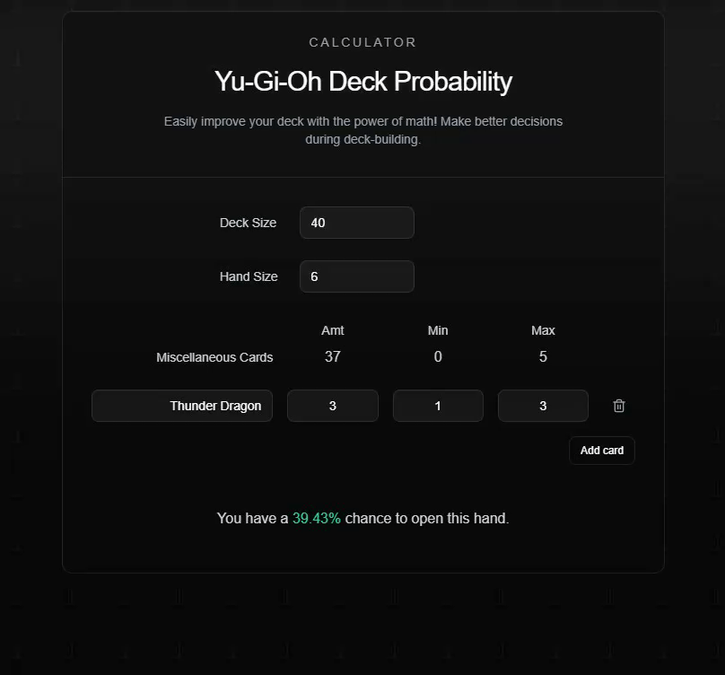

# Yu-Gi-Oh! Deck Calculator

[](https://nextjs.org/)
[](https://www.typescriptlang.org/)
[](https://tailwindcss.com/)
[](https://ui.shadcn.com/)
[](https://vercel.com)
[](LICENSE)
[](https://github.com/nedhmn/ygeometric/actions/workflows/production.yml)

A hypergeometric probability calculator for Yu-Gi-Oh! deck optimization. Calculate the odds of drawing specific card combinations to build more consistent decks. Spiritual successor to yugioh.party.



🔗 **[https://www.ygeometric.com](https://ygeometric.vercel.app)**

## 🎮 Features

- Calculate probability of drawing specific cards/combinations
- Support for multiple card scenarios
- Mobile-friendly interface

## 📱 Usage

1. Enter your deck size (40-60 cards)
2. Set your opening hand size (typically 5-6 cards)
3. Add card groups you want to calculate probabilities where:
   - Amt is the number of copies in your deck
   - Min is the minimum number of copies you want to see in your hand
   - Max is the maximum number of copies you want to see in your hand
4. View real-time probability calculations

## 💻 Local Development

# Clone the repository

```bash
git clone https://github.com/nedhmn/ygeometric.git
```

# Navigate to the project

```bash
cd ygeometric
```

# Install dependencies

```bash
pnpm install
```

# Start development server

```bash
pnpm dev
```

Open [http://localhost:3000](http://localhost:3000) in your browser.

## 🗺️ Roadmap

- [ ] Keyboard shortcuts to add and remove card groups
- [ ] Better error handling
- [ ] Share results with link
- [ ] More documentation on usage

## 🧮 How It Works

The calculator uses the hypergeometric distribution to compute probabilities. This statistical model is perfect for card games as it calculates the probability of drawing specific cards from a finite deck without replacement.

## 📝 License

This project is licensed under the MIT License - see the [LICENSE](LICENSE) file for details.

## 🙏 Acknowledgments

- Inspired by the original yugioh.party
- Yu-Gi-Oh! is a registered trademark of Konami
- Gote for the url name
- Horsemen
